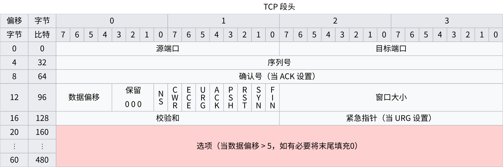

# TCP 握手

> TCP handshake

TCP 传输控制协议（Transmission Control
Protocol）使用**三次握手**（**three-way handshake**）在基于
IP 的网络上建立 TCP/IP 连接

TCP 发送的用于协商和启动 TCP 会话的三个消息分别称为 SYN、SYN-ACK 和
ACK，分别代表 **SYN**chronize、**SYN**chronize-**ACK**nowledgement 和
**ACK**nowledge。三个消息机制的设计是为了让两台想要来回传递信息的计算机可以在传输
HTTP 浏览器请求等数据之前协商连接的参数

主机，通常是浏览器，向服务器发送一个 TCP
SYNchronize 数据包。服务器接收到 SYN 并返回一个
SYNchronize-ACKnowledgement。主机接收到服务器的
SYN-ACK 并发送一个 ACKnowledge。服务器收到 ACK 并建立
TCP 套接字连接

在创建安全连接时，此握手步骤发生在 DNS 查找（DNS
lookup）之后和 TLS 握手（TLS
handshake）之前。连接的每一侧都可以通过四次握手独立终止连接

