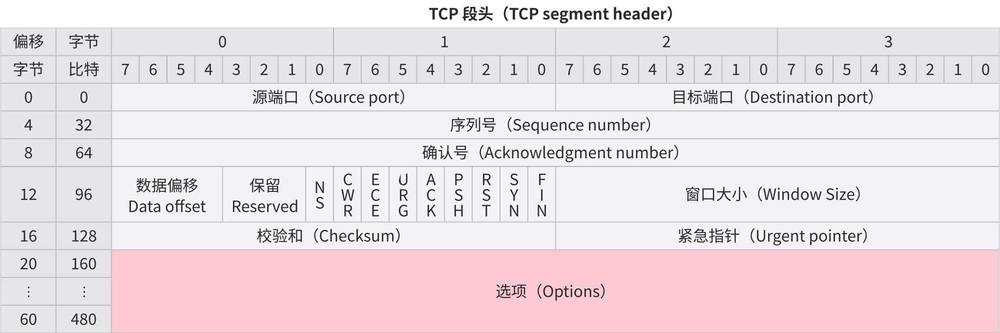
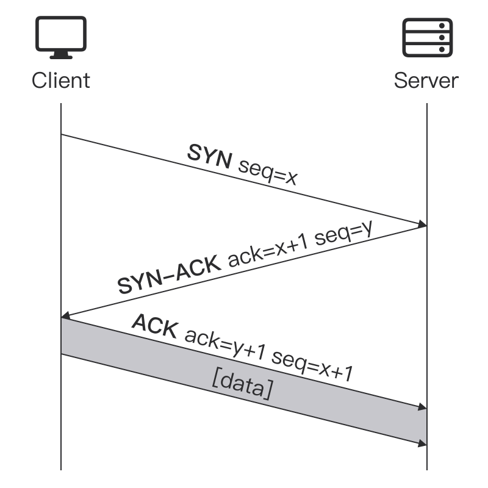
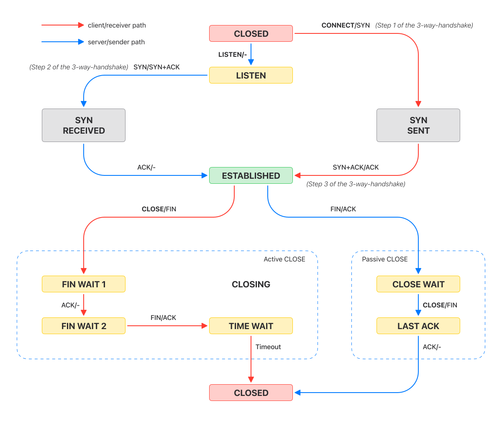

# ✉️ TCP

## 📰 概述

> Overview

**TCP 传输控制协议**（**Transmission Control
Protocol**）是一种面向连接的、可靠的、基于字节流的传输层通信协议。在简化的计算机网络
OSI 模型中，它完成第四层传输层所指定的功能

## 🏗 TCP 段结构

> TCP segment structure

<picture>
  <source media="(prefers-color-scheme: dark)" srcset="./tcp/tcp-segment-header-dark.svg">
  <source media="(prefers-color-scheme: light)" srcset="./tcp/tcp-segment-header-light.svg">
  
</picture>

### 源端口

> Source port (16 bits)

标识发送端口

### 目标端口

> Destination port (16 bits)

标识接收端口

### 序列号

> Sequence number (32 bits)

- 如果 SYN 标识被设置为（1），则这是初始序列号。实际第一个数据字节的序列号和相应
  ACK 中的确认号是这个序列号加 1
- 如果 SYN 标识被清空为（0），则这是当前会话中此段第一个数据字节的累积序列号

### 确认号

> Acknowledgment number (32 bits)

如果设置了 ACK 标识，则此字段的值是 ACK
发送方期望的下一个序列号。这确认收到所有先前的字节（如有）。每端发送的第一个
ACK 确认另一端的初始序列号本身，不含数据

### 数据偏移

> Data offset (4 bits)

用 32 比特（4 字节）为单位指定 TCP 标头的大小。标头最小为
5 个单位，最大为 15 个单位，即最小为 20 个字节，最大为 60 个字节，标头中最多允许
40 个字节的选项。该字段的名称源于它也是从 TCP 段开始到实际数据的偏移量

### 保留

> Reserved (3 bits)

供将来使用，应置零

### 标识

> Flags (9 bits)

包含 9 个 1 比特标识

- NS（ECN-nonce）：隐藏保护
- CWR（Congestion window reduced）：拥塞窗口减少
- ECE（ECN-Echo）：具有双重作用
  - 如果 SYN 被设置为（1），则 TCP 对等体支持 ECN
  - 如果 SYN 被清空为（0），用作对 TCP 发送方网络拥塞的指示
- URG（Urgent）：表示紧急指针字段有效
- ACK（Acknowledgment）：表示确认号字段有效。客户端发送的初始 SYN
  数据包之后的所有数据包都应设置此标识
- PSH（Push）：推送功能。要求将缓冲数据推送到接收应用程序
- RST（Reset）：重置连接
- SYN（Synchronize）：同步序列号。只有从两端发送的第一个数据包才应该设置此标识。其它一些标识和字段根据此标识改变含义，一些仅在设置时有效，另一些在清空时有效
- FIN：发送方的最后一个数据包

### 窗口大小

> Window size (16 bits)

接收窗口的大小，指定此段的发送方当前可以接收的单位窗口大小的数量

### 校验和

> Checksum (16 bits)

用于 TCP 标头、负载和 IP 伪标头的错误检查

### 紧急指针

> Urgent pointer (16 bits)

如果设置了 URG 标识，那么这表示最后一个紧急数据字节的序列号偏移量

### 选项

> Options (Variable 0–320 bits, in units of 32 bits)

该字段长度由数据偏移决定。选项最多有三个字段

- 选项种类（1 字节）
- 选项长度（1 字节）
- 选项数据（可变）

| Option-Kind | Option-Length | Option-Data | Purpose              |
| ----------- | ------------- | ----------- | -------------------- |
| 0           | -             | -           | End of options list  |
| 1           | -             | -           | No operation         |
| 2           | 4             | SS          | Maximum segment size |
| 3           | 3             | S           | Window scale         |

## 🤝 TCP 握手

> TCP handshake

<picture>
  <source media="(prefers-color-scheme: dark)" srcset="./tcp/tcp-handshake-dark.svg">
  <source media="(prefers-color-scheme: light)" srcset="./tcp/tcp-handshake-light.svg">
  
</picture>

TCP 使用**三次握手**（**three-way handshake**）在基于
IP 的网络上建立 TCP/IP 连接

TCP 发送的用于协商和启动 TCP 会话的三个消息分别称为 SYN、SYN-ACK 和
ACK，分别代表 **SYN**chronize、**SYN**chronize-**ACK**nowledgement 和
**ACK**nowledge。三个消息机制的设计是为了让两台想要来回传递信息的计算机可以在传输
HTTP 浏览器请求等数据之前协商连接的参数

主机，通常是浏览器，向服务器发送一个 TCP
SYNchronize 数据包。服务器接收到 SYN 并返回一个
SYNchronize-ACKnowledgement。主机接收到服务器的
SYN-ACK 并发送一个 ACKnowledge。服务器收到 ACK 并建立
TCP 套接字连接

在创建安全连接时，此握手步骤发生在 DNS 查找（DNS
lookup）之后和 TLS 握手（TLS
handshake）之前。连接的每一侧都可以通过四次握手独立终止连接

## TCP 套接字状态

> TCP socket states

<picture>
  <source media="(prefers-color-scheme: dark)" srcset="./tcp/tcp-state-diagram-dark.svg">
  <source media="(prefers-color-scheme: light)" srcset="./tcp/tcp-state-diagram-light.svg">
  
</picture>

LISTEN
: Server
等待来自任何远程 TCP 端点的连接请求

SYN-SENT
: Client
在发送连接请求后等待匹配的连接请求

SYN-RECEIVED
: Server
在收到并发送连接请求后等待确认连接请求

ESTABLISHED
: Server and client
打开连接，接收的数据可以传递给用户。连接数据传输阶段的正常状态

FIN-WAIT-1
: Server and client
等待远程 TCP 的连接终止请求，或之前发送的连接终止请求的确认

FIN-WAIT-2
: Server and client
等待远程 TCP 的连接终止请求

CLOSE-WAIT
: Server and client
等待本地用户的连接终止请求

CLOSING
: Server and client
等待远程 TCP 的连接终止请求确认

LAST-ACK
: Server and client
等待之前发送到远程 TCP 的连接终止请求的确认（包括对其连接终止请求的确认）

TIME-WAIT
: Server or client
等待足够的时间来确保连接上的所有剩余数据包都已过期

CLOSED
: Server and client
完全没有连接状态
