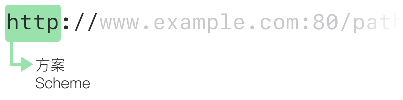
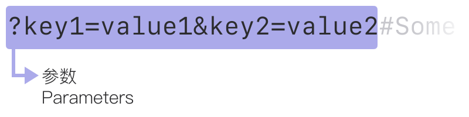
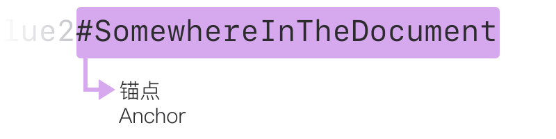

# 🔗 什么是 URL？

> What is a URL?

## 📰 概述

> Summary

HTTP 请求的目标称为「资源 🪵」，其性质没有进一步定义；它可以是文档 📄、照片 🏞 或其他任何东西。每个资源都由一个统一资源标识符（Uniform
Resource Identifier）标识，该标识符在整个 HTTP 中用于标识资源

URI 最常见的形式是 URL，也就是众所周知的网址

```text
https://developer.mozilla.org
https://developer.mozilla.org/en-US/docs/Learn/
https://developer.mozilla.org/en-US/search?q=URL
```

**URL** 代表统一资源定位器 🧭（Uniform Resource Locator）。URL
只不过是 Web 上给定唯一资源的地址。理论上，每个有效的
URL 都指向一个唯一资源

## 🔬 基础：URL 剖析

> Basics: anatomy of a URL

URL 由不同的部分组成，有些是必备的，有些则是可选的。下面的
URL 高亮显示了最重要的部分

<picture>
  <source media="(prefers-color-scheme: dark)" srcset="./url/mdn-url-all-dark.svg">
  <source media="(prefers-color-scheme: light)" srcset="./url/mdn-url-all-light.svg">
  
</picture>

## 🖋 方案

> Scheme

<picture>
  <source media="(prefers-color-scheme: dark)" srcset="./url/mdn-url-protocol-dark.svg">
  <source media="(prefers-color-scheme: light)" srcset="./url/mdn-url-protocol-light.svg">
  
</picture>

它表示浏览器请求资源必须使用的协议。通常对于网站，协议是
HTTPS 或 HTTP

## 👑 权威

> Authority

<picture>
  <source media="(prefers-color-scheme: dark)" srcset="./url/mdn-url-authority-dark.svg">
  <source media="(prefers-color-scheme: light)" srcset="./url/mdn-url-authority-light.svg">
  
</picture>

> 权威包括域名和端口

- 域名指示正在请求哪个 Web 服务器
- 端口表示用于访问 Web 服务器上资源的「入口」。标准端口（HTTP
  为 80，HTTPS 为 443）通常省略

## 🐾 资源路径

> Path to resource

<picture>
  <source media="(prefers-color-scheme: dark)" srcset="./url/mdn-url-path-dark.svg">
  <source media="(prefers-color-scheme: light)" srcset="./url/mdn-url-path-light.svg">
  
</picture>

在 Web 的早期，这样的路径表示
Web 服务器上的物理文件位置。如今，它主要是由
Web 服务器处理的抽象路径

## 🎛 参数

> Parameters

<picture>
  <source media="(prefers-color-scheme: dark)" srcset="./url/mdn-url-parameters-dark.svg">
  <source media="(prefers-color-scheme: light)" srcset="./url/mdn-url-parameters-light.svg">
  
</picture>

参数是用 `&` 分隔的键/值对列表。Web
服务器可以在返回资源之前使用这些参数来执行额外的操作

## ⚓️ 锚点

> Anchor

<picture>
  <source media="(prefers-color-scheme: dark)" srcset="./url/mdn-url-anchor-dark.svg">
  <source media="(prefers-color-scheme: light)" srcset="./url/mdn-url-anchor-light.svg">
  
</picture>

代表资源内的一种「书签 🔖」，为浏览器提供了显示位于「书签」位置内容的指示。`#`
之后的内容不会随请求发送到服务器

## 🆚 绝对 URL 与相对 URL

> Absolute URLs vs relative URLs

在浏览器的地址栏中，URL 没有任何上下文，因此必须提供完整的 URL

当在文档中使用 URL 时，因为浏览器已经拥有文档自己的
URL，可以使用此信息来填充文档中 URL 的缺失部分

### 绝对 URL 示例

> Examples of absolute URLs

```text
https://developer.mozilla.org/en-US/docs/Learn
```

```text
//developer.mozilla.org/en-US/docs/Learn
```

```text
/en-US/docs/Learn
```

### 相对 URL 示例

> Examples of relative URLs

```text
Skills/Infrastructure/Understanding_URLs
```

```text
../CSS/display
```

## 💬 语义 URL

> Semantic URLs

- 更容易操纵
- 为用户阐明了他们在哪里、他们在做什么、他们在 Web 上阅读或与之交互的内容
- 一些搜索引擎可以使用这些语义来改进相关页面的分类

## 参考文档

1. [URI](https://developer.mozilla.org/en-US/docs/Glossary/URI)
2. [URL](https://developer.mozilla.org/en-US/docs/Glossary/URL)
3. [What is a URL?](https://developer.mozilla.org/en-US/docs/Learn/Common_questions/What_is_a_URL)
