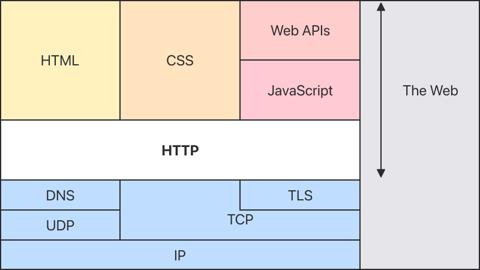
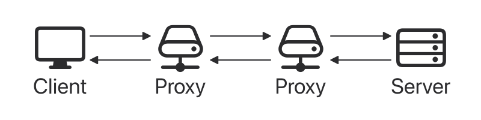

# HTTP 概述

> An overview of HTTP

**HTTP** 是一种获取 HTML
文档等资源的协议。它是 Web 上任何数据交换的基础，也是一种客户端-服务器协议，这意味着请求由接收方发起，通常是
Web 浏览器。使用获取的各种子文档（例如文本、布局描述、图像、视频、脚本等）重建完整的文档

客户端和服务器通过交换单独的消息（而不是数据流）进行通信。客户端（通常是
Web 浏览器）发送的消息称为请求，服务器发送的作为应答的消息称为响应

<picture>
  <source media="(prefers-color-scheme: dark)" srcset="./overview/http-layers-dark.svg">
  <source media="(prefers-color-scheme: light)" srcset="./overview/http-layers-light.svg">
  
</picture>

HTTP 设计于 1990 年代初，是一种随时间的推移而演变的可扩展协议。它是通过
TCP 或 TLS 加密的 TCP
连接发送的应用层协议，尽管理论上可以使用任何可靠的传输协议。由于其可扩展性，它不仅用于获取超文本文档，还用于获取图像和视频，或将内容发布到服务器，例如
HTML 表单结果。HTTP 还可用于获取文档片段，以按需更新 Web 页面

## 基于 HTTP 系统的组件

> Components of HTTP-based systems

HTTP 是一种客户端-服务器协议：请求由一个实体，即用户代理（或代表它的代理）发送。大多数情况下，用户代理是
Web 浏览器，但它可以是任何东西，例如，一个爬取
Web 以填充和维护搜索引擎索引的机器人

每个单独的请求都被发送到服务器，服务器处理它并提供一个称为响应的应答。在客户端和服务器之间有许多实体，统称为代理，它们执行不同的操作，例如充当网关或缓存

<picture>
  <source media="(prefers-color-scheme: dark)" srcset="./overview/client-server-chain-dark.svg">
  <source media="(prefers-color-scheme: light)" srcset="./overview/client-server-chain-light.svg">
  
</picture>

实际上，在浏览器和处理请求的服务器之间有更多的计算机：有路由器、调制解调器等。得益于
Web 的分层设计，这些都隐藏在网络层和传输层中。HTTP
位于最上层的应用层。尽管对于诊断网络问题很重要，但下层大多与 HTTP 的描述无关

### 客户端：用户代理

> Client: the user-agent

用户代理是代表用户行事的任何工具 。此角色主要由
Web 浏览器执行，但也可能是工程师和
Web 开发人员用于调试应用的程序

浏览器**始终**是发起请求的实体。它永远不是服务器（尽管这些年来已经添加了一些机制来模拟服务器发起的消息）

为了显示 Web 页面，浏览器发送原始请求来获取代表该页面的
HTML 文档。然后它解析这个文件，发出与执行脚本、显示布局信息（CSS）以及页面中包含的子资源（通常是图像和视频）相对应的附加请求。然后，Web
浏览器结合这些资源来呈现完整的文档，即 Web
页面。浏览器执行的脚本可以在之后的阶段获取更多资源，并相应地更新 Web 页面

Web 页面是超文本文档。这意味着显示内容的某些部分是链接，可以激活（通常通过单击鼠标）以获取新
Web 页面，从而允许用户指示他们的用户代理并在
Web 中导航。浏览器将这些指示转换为 HTTP 请求，并进一步解释
HTTP 响应以向用户呈现清晰的响应

### Web 服务器

> The Web server

通信通道的另一端是服务器，它根据客户端的请求提供文档。服务器虚拟地只显示为一台机器；但它实际上可能是一组共享负载的服务器（负载均衡），或者是一个复杂的软件，它询问其他计算机（如缓存、数据库服务器或电子商务服务器），完全或部分地按需生成文档

服务器不一定是整台机器，而是可以在同一台机器上托管多个服务器软件实例。使用
HTTP/1.1 和 Host 标头，它们甚至可以共享相同的 IP
地址

### 代理

> Proxies

在 Web 浏览器和服务器之间，许多计算机和机器中继 HTTP
消息。由于 Web 堆栈的分层结构，其中大多数在传输、网络或物理级别运行，相对
HTTP
层而言就是透明的，并有可能对性能产生重大影响。那些在应用层操作的通常被称为代理。这些可以是透明的，转发他们收到的请求而不以任何方式更改它们，或者是不透明的，在这种情况下，它们会在将请求传递给服务器之前以某种方式更改请求。代理可以执行许多功能：

- 缓存（缓存可以是公共的或私有的，如浏览器缓存）
- 过滤（如防病毒扫描或家长控制）
- 负载均衡（允许多台服务器服务不同的请求）
- 身份验证（控制对不同资源的访问）
- 日志记录（允许存储历史信息）

## HTTP 的基本方面

> Basic aspects of HTTP

### HTTP 很简单

> HTTP is simple

HTTP 通常被设计为简单易读，即使 HTTP/2 通过将 HTTP 消息封装到帧中引入了额外的复杂性。HTTP
消息可以被阅读和理解，为开发人员提供了更容易的测试，并为初学者降低了复杂性。

### HTTP 是可扩展的

> HTTP is extensible

在 HTTP/1.0 中引入的 HTTP 标头使该协议易于扩展和实验。甚至可以通过客户端和服务器之间关于新标头语义的简单协议来引入新功能。

### HTTP 是无状态的，但不是无会话的

> HTTP is stateless, but not sessionless

HTTP 是无状态的：在同一连接上连续执行的两个请求之间没有关系。对于试图连贯地与某些页面交互的用户来说，这会立即成为问题，例如，使用电子商务购物车。但是，虽然
HTTP 本身的核心是无状态的，但 HTTP Cookie 允许使用有状态会话。使用标头可扩展性，HTTP
Cookie 被添加到工作流中，允许在每个
HTTP 请求上创建会话以共享相同的上下文或相同的状态。

### HTTP 和连接

> HTTP and connections

连接是在传输层控制的，因此基本上超出了 HTTP 的范围。HTTP
不要求底层传输协议是基于连接的；它只要求它是可靠的，或者不丢失消息（至少在这种情况下会出现错误）。在
Internet 上最常见的两种传输协议中，TCP 是可靠的，而
UDP 则不是。因此，HTTP 依赖于基于连接的 TCP 标准。

在客户端和服务器可以交换 HTTP 请求/响应对之前，它们必须建立
TCP 连接，这个过程需要多次往返。HTTP/1.0 的默认行为是为每个
HTTP 请求/响应对打开一个单独的 TCP
连接。当多个请求连续发送时，这比共享单个 TCP 连接效率低。

为了缓解这一缺陷，HTTP/1.1 引入了流水线（事实证明很难实现）和持久连接：底层
TCP 连接可以使用 Connection 标头部分控制。HTTP/2
更进一步，通过在单个连接上多路复用消息，帮助保持连接预热和效率。

## HTTP 可以控制什么

> What can be controlled by HTTP

随着时间的推移，HTTP 的这种可扩展性允许对 Web 进行更多的控制和功能。缓存和身份验证方法是 HTTP
历史早期就有的功能。相比之下，放宽来源限制的能力是在 2010 年代才添加的

以下是可使用 HTTP 控制的常见功能列表

- 缓存 文档的缓存方式可以由 HTTP 控制。服务器可以指示代理和客户端缓存什么以及缓存多长时间。客户端可以指示中间缓存代理忽略存储的文档

- 放宽来源限制 为了防止窥探和其他隐私侵犯，Web 浏览器强制实施 Web 网站之间的严格分离。只有来自**同源**
  的页面才能访问当前网页的所有信息。尽管这样的约束对服务器来说是一种负担，HTTP
  标头可以放宽服务器端的这种严格分离，允许文档成为来自不同域名的信息拼凑而成；甚至可能有与安全相关的理由这样做。

- 身份验证 某些页面可能受到保护，因此只有特定用户才能访问它们。基本身份验证可以由 HTTP 提供，通过使用
  `WWW-Authenticate` 和类似的标头，也可以使用
  HTTP cookie 设置特定会话

- 代理和隧道传输 服务器或客户端通常位于内网（Intranet）上，并且对其他计算机隐藏其真实 IP 地址。然后 HTTP
  请求通过代理来跨越这个网络屏障。并非所有代理都是
  HTTP 代理。例如，SOCKS 协议在较低级别运行。其他协议，如 ftp，可以由这些代理处理

- 使用 HTTP cookie 的会话 允许将请求与服务器的状态关联起来。这会创建会话，尽管基本 HTTP
  是无状态协议。这不仅适用于电子商务购物车，而且适用于任何允许用户配置内容输出的网站

## HTTP 流

> HTTP flow

## HTTP 消息

> HTTP Messages

### 请求

> Requests

### 响应

> Responses

## 基于 HTTP 的 API

> APIs based on HTTP

## 总结

> Conclusion
